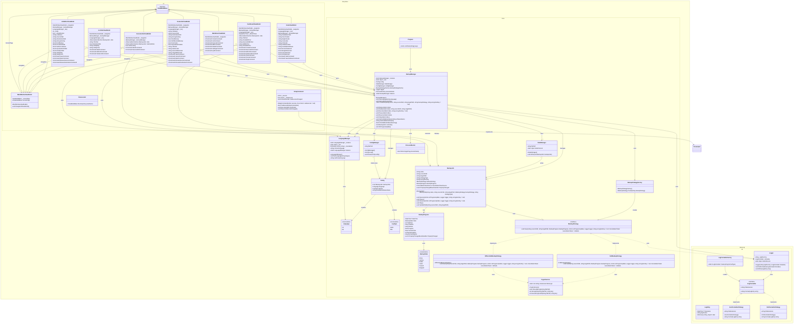

```mermaid
classDiagram
    direction TB

    namespace EasySave.Core {

        class Program {
            +static void Main(string[] args)
        }

        class BackupManager {
            -static BackupManager _instance
            -static object _lock
            -Config config
            -StateManager stateManager
            -ConfigManager configManager
            -BackupStrategyFactory backupStrategyFactory
            -Logger logger
            -ProcessMonitor processMonitor
            +static BackupManager Instance
            -BackupManager()
            +void SetLanguage(string language)
            +void SetLog(string logType)
            +bool CreateJob(string name, string sourcePath, string targetPath, string backupStrategy, string encryptionKey = null)
            +void DeleteJob(int index)
            +void ModifyJob(int index, string sourcePath, string targetPath)
            +void ExecuteJob(int index, string encryptionKey = null)
            +void PauseJob(int index)
            +void ResumeJob(int index)
            +void StopJob(int index)
            +void SetForbiddenSoftware(string softwareName)
            +string GetForbiddenSoftware()
            +bool IsForbiddenSoftwareRunning()
            +List~BackupJob~ ListJobs()
            -void OnProgressUpdate()
        }

        class BackupStrategyFactory {
            +BackupStrategyFactory()
            +IBackupStrategy Create(string backupStrategy)
        }

        class StateManager {
            -string filePath
            -static object stateFileLock
            +StateManager()
            +void Write(List~BackupJob~ backupJobs)
        }

        class ConfigManager {
            -string filePath
            +ConfigManager()
            +Config Load()
            +void Save(Config config)
        }

        class Config {
            +List~BackupJob~ backupJobs
            +Language language
            +LogType logType
            +string forbiddenSoftwareName
        }

        class LanguageManager {
            -static LanguageManager _instance
            -static object _lock
            -Dictionary~string, string~ _translations
            +string CurrentLanguage
            +static LanguageManager Instance
            -LanguageManager()
            +void SetLanguage(string langue)
            +string GetText(string key)
        }

        class Language {
            <<enumeration>>
            FR
            EN
        }

        class LogType {
            <<enumeration>>
            JSON
            XML
        }

        class ProcessMonitor {
            +bool IsRunning(string processName)
        }

        class BackupJob {
            +string name
            +string sourcePath
            +string targetPath
            +string strategyType
            +string encryptionKey
            -IBackupStrategy backupStrategy
            +BackupProgress backupProgress
            +CancellationTokenSource CancellationTokenSource
            +event PropertyChangedEventHandler PropertyChanged
            +BackupJob()
            +BackupJob(string name, string sourcePath, string targetPath, IBackupStrategy backupStrategy, string strategyType)
            +void Execute(Action onProgressUpdate, Logger logger, string encryptionKey = null)
            +void Pause()
            +void Resume(Action onProgressUpdate, Logger logger, string encryptionKey = null)
            +void Stop()
            +void UpdatePaths(string sourcePath, string targetPath)
        }

        class BackupProgress {
            +DateTime? DateTime
            +BackupState State
            +int TotalFiles
            +long TotalSize
            +long FileSize
            +float Progress
            +float TransferTime
            +int RemainingFiles
            +long RemainingSize
            +event PropertyChangedEventHandler PropertyChanged
        }

        class BackupState {
            <<enumeration>>
            Active
            Inactive
            Ended
            Failed
            Paused
            Stopped
        }

        class IBackupStrategy {
            <<interface>>
            +void Save(string sourcePath, string targetPath, BackupProgress backupProgress, Action onProgressUpdate, Logger logger, string encryptionKey = null, CancellationToken cancellationToken = default)
        }

        class FullBackupStrategy {
            +FullBackupStrategy()
            +void Save(string sourcePath, string targetPath, BackupProgress backupProgress, Action onProgressUpdate, Logger logger, string encryptionKey = null, CancellationToken cancellationToken = default)
        }

        class DifferentialBackupStrategy {
            +DifferentialBackupStrategy()
            +void Save(string sourcePath, string targetPath, BackupProgress backupProgress, Action onProgressUpdate, Logger logger, string encryptionKey = null, CancellationToken cancellationToken = default)
        }

        class CryptoService {
            -static List~string~ ExtensionsToEncrypt
            +CryptoService()
            +bool ShouldEncrypt(string filePath)
            +int EncryptFile(string filePath, string key)
            -int ExecuteCryptoSoft(string filePath, string key)
        }
    }


    namespace EasyLog.dll {

        class LogEntry {
            +DateTime? Timestamp
            +string Application
            +Dictionary~string, object~ data
        }

        class Logger {
            -string _logDirectory
            -ILogFormatter _formatter
            -static object stateFileLock
            +Logger(string logDirectory, ILogFormatter formatter)
            +void SetFormatter(ILogFormatter formatter)
            +void Write(LogEntry entry)
        }

        class ILogFormatter {
            <<interface>>
            +string Format(LogEntry entry)
            +string FileExtension
        }

        class JsonFormatterStrategy {
            +JsonFormatterStrategy()
            +string Format(LogEntry entry)
            +string FileExtension
        }

        class XmlFormatterStrategy {
            +XmlFormatterStrategy()
            +string Format(LogEntry entry)
            +string FileExtension
        }

        class LogFormatterFactory {
            +static ILogFormatter Create(string formatType)
        }
    }


    namespace EasySave.UI {

        class ViewModelBase {
            <<abstract>>
        }

        class MainWindowViewModel {
            -ViewModelBase _currentPage
            +ViewModelBase CurrentPage
            +MainWindowViewModel()
            +void NavigateToDashboard()
        }

        class HomeViewModel {
            -MainWindowViewModel _navigation
            -LanguageManager _lang
            -BackupManager _backupManager
            +string StartButtonText
            +string FrenchLabel
            +string EnglishLabel
            +string JsonLabel
            +string XmlLabel
            +string SoftwareLabel
            +string ForbiddenSoftware
            +bool IsFrenchSelected
            +bool IsEnglishSelected
            +bool IsJsonSelected
            +bool IsXmlSelected
            +ICommand StartCommand
            +ICommand SaveSoftwareCommand
        }

        class DashboardViewModel {
            -MainWindowViewModel _navigation
            -BackupManager _backupManager
            -LanguageManager _lang
            -DispatcherTimer _refreshTimer
            +ObservableCollection~BackupJob~ Jobs
            +string TitleText
            +string CreateBtnText
            +string ExecuteAllBtnText
            +string EditBtnText
            +string DeleteBtnText
            +ICommand CreateCommand
            +ICommand ExecuteAllCommand
            +ICommand EditJobCommand
            +ICommand DeleteJobCommand
            +ICommand PlayCommand
            +ICommand PauseCommand
            +ICommand StopCommand
        }

        class CreateJobViewModel {
            -MainWindowViewModel _navigation
            -BackupManager _backupManager
            -LanguageManager _lang
            +string JobName
            +string SourcePath
            +string DestinationPath
            +string EncryptionKey
            +bool IsFullBackup
            +bool IsDifferentialBackup
            +bool CanCreate
            +bool IsQuotaAlertVisible
            +string TitleText
            +string NameLabel
            +string SourceWatermark
            +string TargetWatermark
            +ICommand SaveCommand
            +ICommand CancelCommand
            +ICommand BackCommand
            +ICommand BrowseSourceCommand
            +ICommand BrowseDestinationCommand
        }

        class ExecuteJobsViewModel {
            -MainWindowViewModel _navigation
            -BackupManager _backupManager
            +ObservableCollection~BackupJob~ Jobs
            +ObservableCollection~BackupJob~ SelectedJobs
            +bool IsExecuting
            +ICommand BackCommand
            +ICommand ExecuteAllCommand
        }

        class ListJobsViewModel {
            -MainWindowViewModel _navigation
            -BackupManager _backupManager
            -LanguageManager _lang
            +ObservableCollection~BackupJob~ Jobs
            +string TitleText
            +bool IsNotifyVisible
            +string NotifyMsg
            +string NotifyColor
            +ICommand BackCommand
            +ICommand EditJobCommand
            +ICommand DeleteJobCommand
        }

        class JobEditorViewModel {
            -MainWindowViewModel _navigation
            -BackupManager _backupManager
            -LanguageManager _lang
            -int _index
            -bool _isModification
            +string JobName
            +string SourcePath
            +string DestinationPath
            +string EncryptionKey
            +bool IsFullBackup
            +bool IsCreationMode
            +bool CanExecuteSave
            +bool IsQuotaAlertVisible
            +bool IsNotifyVisible
            +string NotifyMsg
            +string NotifyColor
            +ICommand SaveCommand
            +ICommand BackCommand
            +ICommand BrowseSourceCommand
            +ICommand BrowseDestinationCommand
        }

        class MainMenuViewModel {
            -MainWindowViewModel _navigation
            +ICommand CreateCommand
            +ICommand ListCommand
            +ICommand ExecuteCommand
            +ICommand EditCommand
            +ICommand DeleteCommand
            +ICommand SettingsCommand
            +ICommand QuitCommand
        }

        class RelayCommand {
            -Action _execute
            -Func~bool~ _canExecute
            +event EventHandler CanExecuteChanged
            +RelayCommand(Action execute, Func~bool~ canExecute = null)
            +bool CanExecute(object parameter)
            +void Execute(object parameter)
            +void RaiseCanExecuteChanged()
        }

        class ViewLocator {
            +ViewModelBase Resolve(string viewName)
        }
    }


    Program --> BackupManager : uses

    BackupManager "1" --> "1" Config : manages
    BackupManager "1" --> "0..*" BackupJob : manages
    BackupManager --> BackupStrategyFactory : uses
    BackupManager --> Logger : uses
    BackupManager --> ProcessMonitor : uses
    BackupManager --> LanguageManager : uses

    BackupStrategyFactory --> IBackupStrategy : creates

    ConfigManager "1" --> "1" Config : loads-saves

    BackupJob "1" --> "1" IBackupStrategy : uses
    BackupJob "1" --> "1" BackupProgress : has

    BackupProgress --> BackupState : uses

    IBackupStrategy <|.. FullBackupStrategy : implements
    IBackupStrategy <|.. DifferentialBackupStrategy : implements

    FullBackupStrategy ..> CryptoService : uses
    DifferentialBackupStrategy ..> CryptoService : uses

    StateManager "1" --> "*" BackupJob : writes

    BackupManager "1" --> "1" StateManager : uses
    BackupManager "1" --> "1" ConfigManager : uses

    IBackupStrategy ..> Logger : uses

    Logger --> ILogFormatter : uses
    ILogFormatter <|.. JsonFormatterStrategy : implements
    ILogFormatter <|.. XmlFormatterStrategy : implements
    LogFormatterFactory --> ILogFormatter : creates

    Config --> Language : contains
    Config --> LogType : contains

    BackupManager --> LanguageManager : uses
    LanguageManager --> Language : uses

    ViewModelBase <|-- MainWindowViewModel
    ViewModelBase <|-- HomeViewModel
    ViewModelBase <|-- DashboardViewModel
    ViewModelBase <|-- CreateJobViewModel
    ViewModelBase <|-- ExecuteJobsViewModel
    ViewModelBase <|-- ListJobsViewModel
    ViewModelBase <|-- JobEditorViewModel
    ViewModelBase <|-- MainMenuViewModel

    MainWindowViewModel "1" --> "1" ViewModelBase : CurrentPage

    HomeViewModel "1" --> "1" BackupManager : uses
    HomeViewModel "1" --> "1" LanguageManager : uses

    DashboardViewModel "1" --> "1" MainWindowViewModel : navigation
    DashboardViewModel "1" --> "1" BackupManager : uses
    DashboardViewModel "1" --> "1" LanguageManager : uses
    DashboardViewModel "*" --> "1" BackupJob : displays

    CreateJobViewModel "1" --> "1" MainWindowViewModel : navigation
    CreateJobViewModel "1" --> "1" BackupManager : uses

    ExecuteJobsViewModel "1" --> "1" MainWindowViewModel : navigation
    ExecuteJobsViewModel "1" --> "1" BackupManager : uses
    ExecuteJobsViewModel "*" --> "1" BackupJob : executes

    ListJobsViewModel "1" --> "1" MainWindowViewModel : navigation
    ListJobsViewModel "1" --> "1" BackupManager : uses

    JobEditorViewModel "1" --> "1" MainWindowViewModel : navigation
    JobEditorViewModel "1" --> "1" BackupManager : uses

    RelayCommand --> ICommand : implements
```
