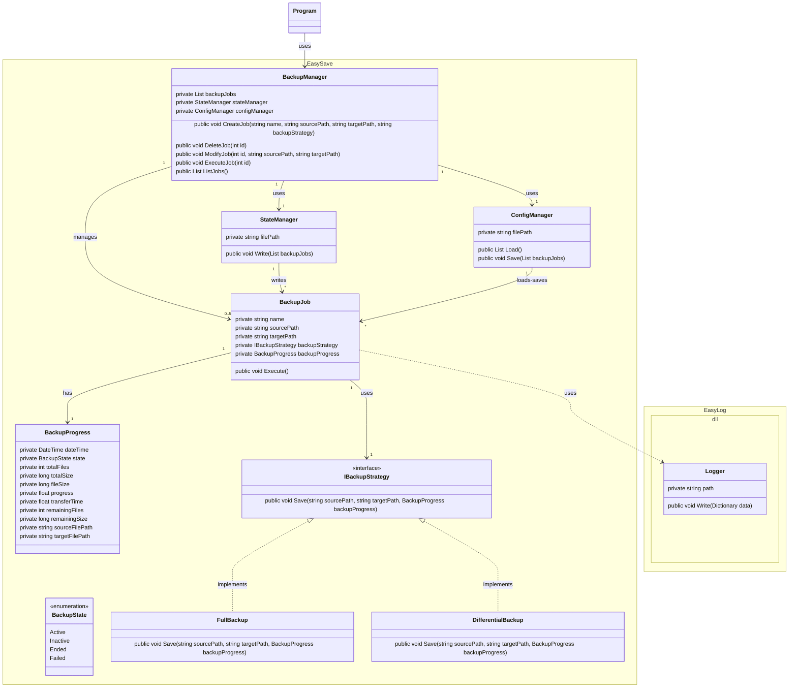

```mermaid
classDiagram
    direction TB

    namespace EasySave{

        class BackupManager {
            private List<BackupJob> backupJobs
            private StateManager stateManager
            private ConfigManager configManager
            public void CreateJob(string name, string sourcePath, string targetPath, string backupStrategy)
            public void DeleteJob(int id)
            public void ModifyJob(int id, string sourcePath, string targetPath)
            public void ExecuteJob(int id)
            public List<BackupJob> ListJobs()
        }

        class StateManager {
            private string filePath
            public void Write(List<BackupJob> backupJobs)
        }

        class ConfigManager {
            private string filePath
            public List<BackupJob> Load()
            public void Save(List<BackupJob> backupJobs)
        }

        class BackupJob {
            private string name
            private string sourcePath
            private string targetPath
            private IBackupStrategy backupStrategy
            private BackupProgress backupProgress
            public void Execute()
        }

        class BackupProgress {
            private DateTime dateTime
            private BackupState state
            private int totalFiles
            private long totalSize
            private long fileSize
            private float progress
            private float transferTime
            private int remainingFiles
            private long remainingSize
            private string sourceFilePath
            private string targetFilePath
        }

        class BackupState{
            <<enumeration>>
            Active
            Inactive
            Ended
            Failed
        }

        class IBackupStrategy {
            <<interface>>
            public void Save(string sourcePath, string targetPath, BackupProgress backupProgress)
        }

        class FullBackup {
            public void Save(string sourcePath, string targetPath, BackupProgress backupProgress)
        }

        class DifferentialBackup {
            public void Save(string sourcePath, string targetPath, BackupProgress backupProgress)
        }

    }

    namespace EasyLog.dll{
        class Logger {
            private string path
            public void Write(Dictionary<string, object> data)
        }
    }

    Program --> BackupManager : uses

    BackupManager "1" --> "0..5" BackupJob : manages

    BackupJob "1" --> "1" IBackupStrategy : uses
    BackupJob "1" --> "1" BackupProgress : has

    IBackupStrategy <|.. FullBackup : implements
    IBackupStrategy <|.. DifferentialBackup : implements

    StateManager "1" --> "*" BackupJob : writes
    ConfigManager "1" --> "*" BackupJob : loads-saves

    BackupManager "1" --> "1" StateManager : uses
    BackupManager "1" --> "1" ConfigManager : uses

    BackupJob ..> Logger : uses
```