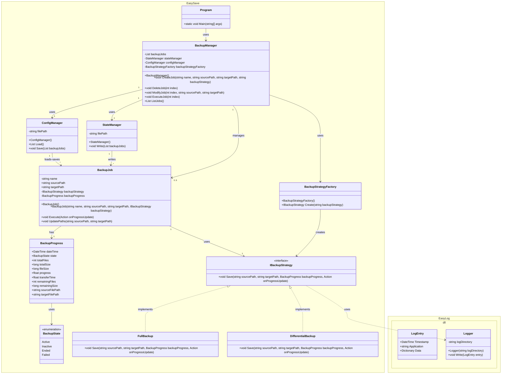

```mermaid
classDiagram
    direction TB

    namespace EasySave {

        class Program {
            +static void Main(string[] args)
        }

        class BackupManager {
            -List<BackupJob> backupJobs
            -StateManager stateManager
            -ConfigManager configManager
            -BackupStrategyFactory backupStrategyFactory
            +BackupManager()
            +bool CreateJob(string name, string sourcePath, string targetPath, string backupStrategy)
            +void DeleteJob(int index)
            +void ModifyJob(int index, string sourcePath, string targetPath)
            +void ExecuteJob(int index)
            +List<BackupJob> ListJobs()
        }

        class BackupStrategyFactory {
            +BackupStrategyFactory()
            +IBackupStrategy Create(string backupStrategy)
        }

        class StateManager {
            -string filePath
            +StateManager()
            +void Write(List<BackupJob> backupJobs)
        }

        class ConfigManager {
            -string filePath
            +ConfigManager()
            +List<BackupJob> Load()
            +void Save(List<BackupJob> backupJobs)
        }

        class BackupJob {
            -string name
            +string sourcePath
            +string targetPath
            -IBackupStrategy backupStrategy
            -BackupProgress backupProgress
            +BackupJob()
            +BackupJob(string name, string sourcePath, string targetPath, IBackupStrategy backupStrategy)
            +void Execute(Action onProgressUpdate)
            +void UpdatePaths(string sourcePath, string targetPath)
        }

        class BackupProgress {
            +DateTime dateTime
            +BackupState state
            +int totalFiles
            +long totalSize
            +long fileSize
            +float progress
            +float transferTime
            +int remainingFiles
            +long remainingSize
            +string sourceFilePath
            +string targetFilePath
        }

        class BackupState {
            <<enumeration>>
            Active
            Inactive
            Ended
            Failed
        }

        class IBackupStrategy {
            <<interface>>
            +void Save(string sourcePath, string targetPath, BackupProgress backupProgress, Action onProgressUpdate)
        }

        class FullBackup {
            +void Save(string sourcePath, string targetPath, BackupProgress backupProgress, Action onProgressUpdate)
        }

        class DifferentialBackup {
            +void Save(string sourcePath, string targetPath, BackupProgress backupProgress, Action onProgressUpdate)
        }
    }


    namespace EasyLog.dll {

        class LogEntry {
            +DateTime Timestamp
            +string Application
            +Dictionary<string, object> Data
        }

        class Logger {
            -string logDirectory
            +Logger(string logDirectory)
            +void Write(LogEntry entry)
        }
    }

    Program --> BackupManager : uses

    BackupManager "1" --> "0..5" BackupJob : manages
    BackupManager --> BackupStrategyFactory : uses

    BackupStrategyFactory --> IBackupStrategy : creates

    BackupJob "1" --> "1" IBackupStrategy : uses
    BackupJob "1" --> "1" BackupProgress : has

    BackupProgress --> BackupState : uses

    IBackupStrategy <|.. FullBackup : implements
    IBackupStrategy <|.. DifferentialBackup : implements

    StateManager "1" --> "*" BackupJob : writes
    ConfigManager "1" --> "*" BackupJob : loads-saves

    BackupManager "1" --> "1" StateManager : uses
    BackupManager "1" --> "1" ConfigManager : uses

    IBackupStrategy ..> Logger : uses
```