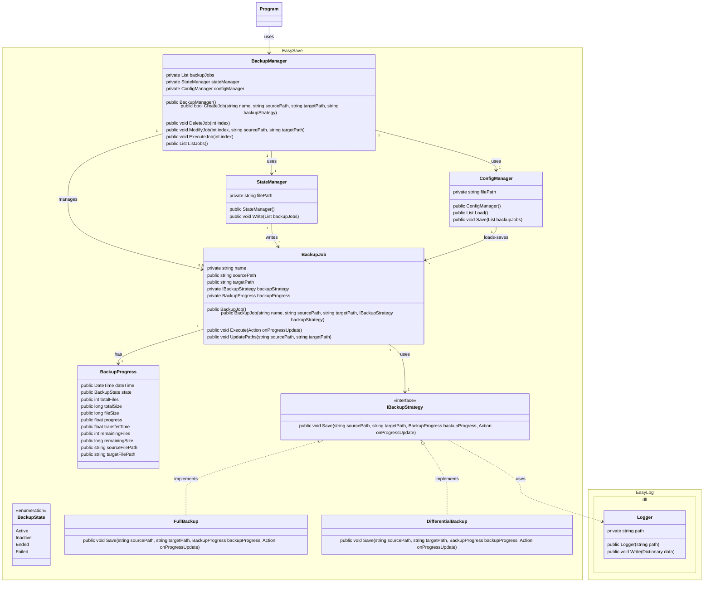

```mermaid
classDiagram
    direction TB

    namespace EasySave{

        class BackupManager {
            private List<BackupJob> backupJobs
            private StateManager stateManager
            private ConfigManager configManager
            public BackupManager()
            public bool CreateJob(string name, string sourcePath, string targetPath, string backupStrategy)
            public void DeleteJob(int index)
            public void ModifyJob(int index, string sourcePath, string targetPath)
            public void ExecuteJob(int index)
            public List<BackupJob> ListJobs()
        }

        class StateManager {
            private string filePath
            public StateManager()
            public void Write(List<BackupJob> backupJobs)
        }

        class ConfigManager {
            private string filePath
            public ConfigManager()
            public List<BackupJob> Load()
            public void Save(List<BackupJob> backupJobs)
        }

        class BackupJob {
            private string name
            public string sourcePath
            public string targetPath
            private IBackupStrategy backupStrategy
            private BackupProgress backupProgress
            public BackupJob()
            public BackupJob(string name, string sourcePath, string targetPath, IBackupStrategy backupStrategy)
            public void Execute(Action onProgressUpdate)
            public void UpdatePaths(string sourcePath, string targetPath)
        }

        class BackupProgress {
            public DateTime dateTime
            public BackupState state
            public int totalFiles
            public long totalSize
            public long fileSize
            public float progress
            public float transferTime
            public int remainingFiles
            public long remainingSize
            public string sourceFilePath
            public string targetFilePath
        }

        class BackupState{
            <<enumeration>>
            Active
            Inactive
            Ended
            Failed
        }

        class IBackupStrategy {
            <<interface>>
            public void Save(string sourcePath, string targetPath, BackupProgress backupProgress, Action onProgressUpdate)
        }

        class FullBackup {
            public void Save(string sourcePath, string targetPath, BackupProgress backupProgress, Action onProgressUpdate)
        }

        class DifferentialBackup {
            public void Save(string sourcePath, string targetPath, BackupProgress backupProgress, Action onProgressUpdate)
        }

    }

    namespace EasyLog.dll{
        class Logger {
            private string path
            public Logger(string path)
            public void Write(Dictionary<string, object> data)
        }
    }

    Program --> BackupManager : uses

    BackupManager "1" --> "0..5" BackupJob : manages

    BackupJob "1" --> "1" IBackupStrategy : uses
    BackupJob "1" --> "1" BackupProgress : has

    IBackupStrategy <|.. FullBackup : implements
    IBackupStrategy <|.. DifferentialBackup : implements

    StateManager "1" --> "*" BackupJob : writes
    ConfigManager "1" --> "*" BackupJob : loads-saves

    BackupManager "1" --> "1" StateManager : uses
    BackupManager "1" --> "1" ConfigManager : uses

    IBackupStrategy ..> Logger : uses
```