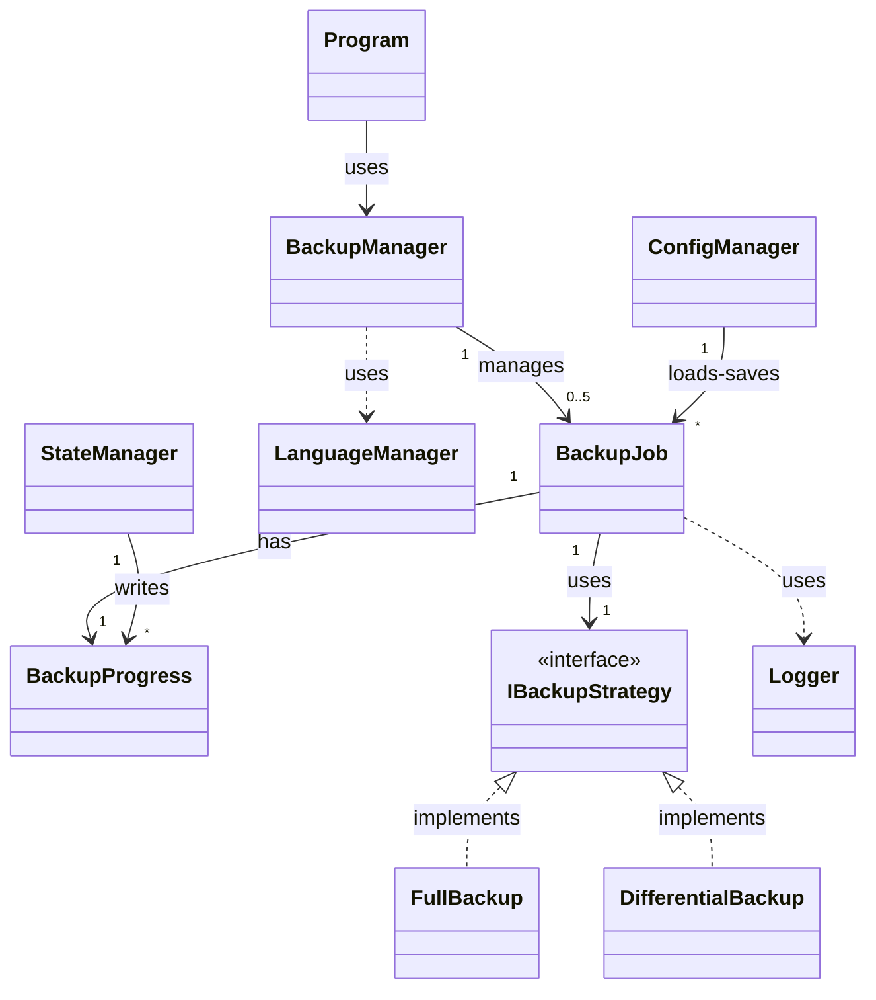

```mermaid
classDiagram
    direction TB

    class BackupManager {
    }

    class StateManager {
    }

    class ConfigManager {
    }

    class LanguageManager {
    }

    class BackupJob {
    }

    class BackupProgress {
    }

    class IBackupStrategy {
        <<interface>>
    }

    class FullBackup {
    }

    class DifferentialBackup {
    }

    class Logger {
    }

    Program --> BackupManager : uses

    BackupManager "1" --> "0..5" BackupJob : manages
    BackupManager ..> LanguageManager : uses

    BackupJob "1" --> "1" IBackupStrategy : uses
    BackupJob "1" --> "1" BackupProgress : has

    IBackupStrategy <|.. FullBackup : implements
    IBackupStrategy <|.. DifferentialBackup : implements

    StateManager "1" --> "*" BackupProgress : writes
    ConfigManager "1" --> "*" BackupJob : loads-saves

    BackupJob ..> Logger : uses
```