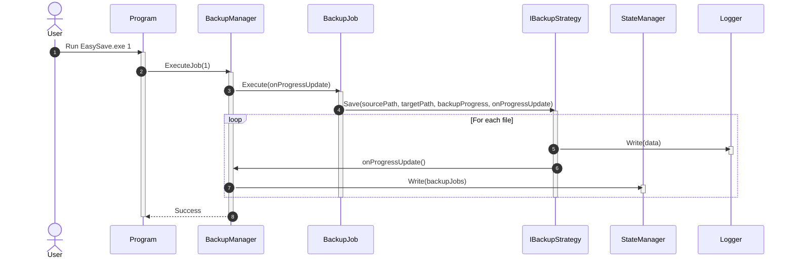

```mermaid
 sequenceDiagram
    autonumber

    actor User
    participant Program
    participant BackupManager
    participant BackupJob
    participant IBackupStrategy
    participant StateManager
    participant Logger

    User->>Program: Run EasySave.exe 1
    activate Program

    Program->>BackupManager: ExecuteJob(1)
    activate BackupManager
    
    BackupManager->>BackupJob: Execute(onProgressUpdate)
    activate BackupJob

    BackupJob->>IBackupStrategy: Save(sourcePath, targetPath, backupProgress, onProgressUpdate)
    activate IBackupStrategy

    loop For each file
        IBackupStrategy->>Logger: Write(data)
        activate Logger
        deactivate Logger

        IBackupStrategy->>BackupManager: onProgressUpdate()
        BackupManager->>StateManager: Write(backupJobs)
        activate StateManager
        deactivate StateManager
    end

    deactivate IBackupStrategy
    deactivate BackupJob
    BackupManager-->>Program: Success
    deactivate BackupManager
    deactivate Program
```